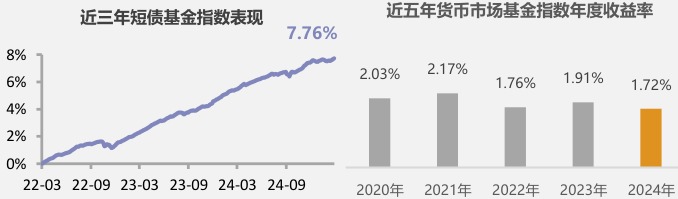
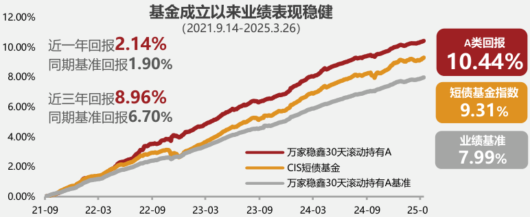

[page-1]
本产品由万家基金管理有限公司发行与管理,代销机构不承担产品的投资、兑付和风险管理责任。

广告

# 万家稳鑫30天滚动持有

## 短债债券型证券投资基金

基金 A类 013207 代码 C类 013208

## 闲钱打理升级, 短债配齐

### 短债基金近年表现好： 短债基金指数近三年年化回报2.61%；而近年来货币市场基金指数回报呈下行趋势，近三年年化回报仅1.81%。

### 闲钱打理升级好选择： 短债基金波动较低、流动性好，目前是广受欢迎的闲钱管理工具。

### 图片描述

#### 左图：近三年短债基金指数表现
- **图表类型**：折线图
- **时间范围**：2022年3月至2024年9月
- **数据趋势**：
  - 起点（2022年3月）：接近0%
  - 终点（2024年9月）：7.76%
  - 整体趋势：逐年上升

#### 右图：近五年货币市场基金指数年度收益率
- **图表类型**：柱状图
- **时间范围**：2020年至2024年
- **年度收益率**：
  - 2020年：2.03%
  - 2021年：2.17%
  - 2022年：1.76%
  - 2023年：1.91%
  - 2024年：1.72%

#### 总结
- 左图显示了近三年短债基金指数的稳步增长，最终达到7.76%。
- 右图展示了近五年货币市场基金指数的年度收益率变化，其中2021年的收益率最高，为2.17%，而2024年的收益率为1.72%。

指数数据来源于wind, 截至2025.03.26。

## 万家稳鑫30天, 追求稳健

基金成立以来回报达10.44%，基金的最大回撤仅-0.13%，年化夏普比率达4.73；同期业绩比较基准收益率7.99%，跑赢基准2.45%。

### 基金成立以来业绩表现稳健
(2021.9.14-2025.3.26)

#### 回报数据：
- **近一年回报**：2.14%
  - 同期基准回报：1.90%
- **近三年回报**：8.96%
  - 同期基准回报：6.70%

#### 指标对比：
- **A类回报**：10.44%
- **短债基金指数**：9.31%
- **业绩基准**：7.99%

#### 图表说明：
- **红色曲线**：万家稳鑫30天滚动持有A
- **橙色曲线**：CIS短债基金
- **灰色曲线**：万家稳鑫30天滚动持有A基准

#### 时间范围：
- 2021年9月（21-09）至2025年3月（25-0）

主要关注剩余期限一年以内、静态收益相对较高的信用债

+

同时配置高资质、高流动性资产，灵活调节久期

贡献票息收益

贡献流动性

万家固收团队采用较外部评级更严格的信用评价体系，追求更精确的个券评价标准。

基金业绩来源于万家基金，经托管行复核，最大回撤、年化夏普比率、指数数据来源于wind，截至2025.3.26。万家稳鑫30天滚动持有成立于2021.09.14，2022-2024年A类净值增长率/业绩比较基准收益率分别为：3.36%/2.17%、2.95%/2.41%、2.65%/2.25%；业绩比较基准为中债综合财富(1年以下)指数收益率*80%+一年期定期存款基准利率(税后)*20%；现任基金经理陈奕雯(20210914至今)。投资策略仅作示例参考，并非合同约定，基金管理人可根据市场情况变化及投资策略需要予以调整。

## 实力固收团队, 居行业前列

* **屡获殊荣：**万家基金成立22年，凭借强劲的综合实力共斩获**56**座行业权威大奖，荣膺**2022、2018、2017**年度金牛基金管理公司大奖，**近六年四度**斩获金基金·TOP公司奖； * **实力固收：**万家固收研团队共**44**人，**擅长大类资产配置，注重安全边际**，追求穿越牛熊的长期稳健回报；研究团队覆盖宏观、信用、可转债等领域，**注重基本面，风控严格**。 * **业绩优异：**万家旗下主动管理固收类基金近七年收益率达**35.45%**。

56座权威大奖包括20座“金牛奖”(《中国证券报》评选)、21座“金基金奖”(《上海证券报》评选)、15座“明星基金奖”(《证券时报》评选)，以上为公司自2002年以来获奖总数，截至2023/12，“金牛基金管理公司”由《中国证券报》分别于2018/3、2019/4、2023/12评选。“金基金TOP公司”由《上海证券报》分别于2019/4、2021/7、2022/11、2023/8评选。固收整体业绩来源于海通证券，截至2024.12.31。固收金牛奖由《中国证券报》评选，“2019年度金基金·债券投报回报基金管理公司奖”由《上海证券报》于2020/7评选。

陈奕雯 清华大学硕士

**10.5年**研究及投资经验，其中**6年**投资经验 2015年3月加入万家基金，现任固定收益部总监助理，万家稳鑫、万家家享等基金的基金经理。自上而下研判市场环境构建投资组合，自下而上基于基本面挖掘个券。

### 其他在管债券型产品业绩表现

<table><thead><tr><th rowspan="2">类型</th><th rowspan="2">基金简称</th><th rowspan="2">成立/转型 日期</th><th rowspan="2">任职日期</th><th colspan="2">近一年</th><th colspan="2">近三年</th></tr><tr><th>回报</th><th>比较基准</th><th>回报</th><th>比较基准</th></tr></thead><tbody><tr><td rowspan="2">短债</td><td>万家稳鑫30天A</td><td>2021/9/14</td><td>2021/9/14</td><td><strong>2.65%</strong></td><td>2.25%</td><td><strong>9.22%</strong></td><td>6.99%</td></tr><tr><td>万家稳安60天持有A</td><td>2023/11/28</td><td>2023/11/28</td><td><strong>4.39%</strong></td><td>4.64%</td><td>--</td><td>--</td></tr><tr><td rowspan="4">中长期 纯债</td><td>万家恒瑞18个月A</td><td>2016/8/15</td><td>2020/9/9</td><td><strong>5.41%</strong></td><td>2.26%</td><td><strong>11.19%</strong></td><td>6.76%</td></tr><tr><td>万家安弘A</td><td>2017/8/18</td><td>2019/2/21</td><td><strong>3.64%</strong></td><td>4.98%</td><td><strong>8.17%</strong></td><td>7.69%</td></tr><tr><td>万家强化收益定开</td><td>2013/5/7</td><td>2019/2/21</td><td><strong>3.22%</strong></td><td>2.76%</td><td><strong>8.43%</strong></td><td>8.26%</td></tr><tr><td>万家增强收益</td><td>2007/9/29</td><td>2022/7/14</td><td><strong>1.88%</strong></td><td>8.83%</td><td><strong>2.05%</strong></td><td>18.51%</td></tr><tr><td>二级债基</td><td>万家惠利A</td><td>2022/10/25</td><td>2022/10/25</td><td><strong>2.45%</strong></td><td>6.28%</td><td>--</td><td>--</td></tr></tbody></table>

基金业绩数据及比较基准数据来源于定期报告，截至2024.12.31。陈奕雯在管的债券型基金万家稳航90天因成立不满一年不予展示业绩。

*“万家稳鑫30天滚动持有成立于2021.09.14，2022-2024年A类净值增长率/业绩比较基准收益率分别为：3.36%/2.17%、2.95%/2.41%、2.65%/2.25%；业绩比较基准为中债综合财富(1年以下)指数收益率*80%+一年期定期存款基准利率(税后)*20%；现任基金经理陈奕雯(20210914至今)。*万家稳安60天滚动持有成立于2023.11.28，2024年A类净值增长率/业绩比较基准收益率分别为：4.39%/4.64%；业绩比较基准为中债总指数收益率*80%+一年期定期存款基准利率(税后)*20%；现任基金经理陈奕雯(20221128至今)。*万家恒瑞18个月成立于2016.08.15，2020-2024年A类净值增长率/业绩比较基准收益率分别为：3.04%/2.10%、4.13%/2.25%、1.99%/2.25%、3.42%/2.28%、5.41%/2.26%；业绩比较基准为同期1年银行定期存款利率(税后)*150%；近五年历任基金经理：陈奕雯(20200909至今)，陶潜伟(20180301-20200909)。*万家安弘成立于2017.08.18，2020-2024年A类净值增长率/业绩比较基准收益率分别为：4.12%/-0.06%、4.68%/2.10%、1.41%/0.51%、2.92%/2.05%、3.64%/4.98%；业绩比较基准为中债综合指数收益率(全价)；近五年历任基金经理：陈奕雯(20190221至今)。苏谋东(20170818-20210325)，万家增强收益成立于2004.09.28，于2007.09.29由万家保本债转型为本基金，2020-2024年净值增长率/业绩比较基准收益率分别为：6.76%/3.05%、3.74%/5.65%、-3.09%/3.49%、3.37%/5.23%、1.88%/8.83%；业绩比较基准为中正全债指数；近五年历任基金经理：陈奕雯(20220714至今)，束金伟(20220714至今)，董一平(20210824-20230116)，苏谋东(20180918-20220406)，陶潜伟(20180815-20190909)，李文真(2017114-20190116)。本基金于2020.12.21修改投资范围，增加存托凭证为投资标的。详闻法律文件，万家强化收益定开成立于2013.05.07，2020-2024年净值增长率/业绩比较基准收益率分别为：3.50%/2.76%、4.63%/2.75%、1.60%/2.75%、3.39%/2.78%、3.22%/2.76%。业绩比较基准为三年期银行定期存款收益率(税后)，近五年历任基金经理：陈奕雯(20190221至今)。苏谋东(20130529-20210325)，万家家享中债纯债债券型证券投资基金转型为本基金，2020-2024年A类净值增长率/业绩比较基准收益率分别为：1.35%/2.37%、3.04%/3.27%、2.77%/2.48%、3.45%/2.59%、3.39%/3.42%。业绩比较基准为中债总财富(1-3年)指数收益率*80%+一年期定期存款利率(税后)*20%；近五年历任基金经理陈奕雯(20200917至今)，侯基隆(20181208-20200917)，周潜伟(20180301-20191008)。万家惠利券成立于2022.10.25，2023-2024年A类净值增长率/业绩比较基准收益率分别为：-0.11%/0.65%、2.45%/6.28%。业绩比较基准为中债新综合指数(全价)收益率*90%+沪深300指数收益率*5%+恒生指数收益率*5%。近五年历任基金经理：陈奕雯(20222105至今)，张永强(20230801至今)，章恒(20221025-20231109)，以上年度业绩和基准数据来自各基金定期报告。

注：产品要素信息请以招募说明书及基金合同为准。

<table><tr><td>基金名称</td><td colspan="3">万家稳鑫30天滚动持有短债债券型证券投资基金</td></tr><tr><td>基金托管人</td><td colspan="3">邮政储蓄银行</td></tr><tr><td>基金经理</td><td colspan="3">陈奕雯</td></tr><tr><td>投资范围</td><td colspan="3">本基金的投资范围为具有良好流动性的金融工具，包括国内依法发行上市的债券(国债、央行票据、地方政府债、金融债、企业债、公司债、证券公司短期公司债、政府支持机构债、次级债、中期票据、短期融资券、超短期融资券、可分离交易可转债的纯债部分等)、资产支持证券、债券回购、银行存款、同业存单、货币市场工具、国债期货、信用衍生品以及法律法规或中国证监会允许基金投资的其他金融工具。本基金不投资于股票，也不投资于可转换债券(可分离交易可转债的纯债部分除外)、可交换债券。如法律法规或监管机构以后允许基金投资其他品种，基金管理人在履行适当程序后，可以将其纳入投资范围。</td></tr><tr><td>投资比例</td><td colspan="3">本基金投资于债券资产不低于基金资产的80%，其中投资于短期债券的比例不低于非现金资产的80%；每个交易日日终，扣除国债期货合约需缴纳的交易保证金后，保持不低于基金资产净值5%的现金或者到期日在一年以内的政府债券，现金不包括结算备付金、存出保证金、应收申购款等。本基金所指的短期债券是指剩余期限或回售期限不超过397天(含)的债券资产，主要包括国债、央行票据、地方政府债、金融债、企业债、公司债、证券公司短期公司债、政府支持机构债、次级债、中期票据、短期融资券、超短期融资券、可分离交易可转债的纯债部分等金融工具。</td></tr><tr><td>业绩比较基准</td><td colspan="3">中债综合财富(1年以下)指数收益率*80%+一年期定期存款基准利率(税后)*20%</td></tr><tr><td>风险收益特征</td><td colspan="3">本基金为债券型基金，其长期平均风险和预期收益率理论上低于股票型基金、混合型基金，高于货币市场基金。</td></tr></table>

<table><thead><tr><th></th><th>区间</th><th>A类</th><th>C类</th></tr></thead><tbody><tr><td>申购费率 (M为申购金额)</td><td>M&lt;100万 100万≤M&lt;500万 M≥500万</td><td>0.40% 0.20% 每笔1,000元</td><td>0</td></tr><tr><td>赎回费率</td><td colspan="3">因为本基金对每份基金份额设定30天的滚动运作期，因此本基金不收取赎回费用。</td></tr><tr><td>销售服务费(年)</td><td>--</td><td>--</td><td>0.20%</td></tr><tr><td>管理费率(年)</td><td>--</td><td>0.20%</td><td></td></tr><tr><td>托管费率(年)</td><td>--</td><td>0.05%</td><td></td></tr></tbody></table>

风险提示：基金有风险，投资需谨慎。基金的过往业绩不预示其未来表现，基金管理人管理的其他基金的业绩和其研究人员取得的过往业绩并不预示其未来表现，也不构成基金业绩表现的保证。本产品由万家基金管理有限公司发行与管理，代销机构不承担产品的投资、兑付与风险管理责任。本基金的风险等级为PR2中低风险。在代销机构购买时，应以代销机构的风险评级规则为标准，代销机构风险评级不低于管理人的评级结果，请投资者选择符合风险承受能力、投资目标的产品。本基金的特有风险包括但不限于滚动持有运作方式的风险，例如每个运作周期到期日前，基金份额持有人不能赎回或转换出本基金份额；运作期到期日，基金份额持有人未申请赎回或转换出以及申请确认失败，到期日的基金份额自动进入下一个运作周期的风险；考虑到期日、法定节假日等非工作日或非开放时间现金业务申请等原因，每个基金份额的每个实际运作期限或有不同，可能长于或短于30天。证券市场因宏观经济等因影响而引起波动，将引起基金收益水平发生波动的潜在风险。投资者购买本基金时应详细阅读基金合同、招募说明书、产品资料概要等法律文件，了解基金基本情况，基金法律文件中关于基金风险收益特征与产品风险等因参考因素不同而存在表述差异，投资者应结合自身投资目的、期限、风险偏好、投资承受能力审慎决策并承担相应投资风险。在代销机构购买时，应以代销机构的风险评级规则为准，基金管理人承诺以诚实信用、勤勉尽责的原则管理和运用基金资产，但不保证基金一定盈利，也不保证最低收益。
